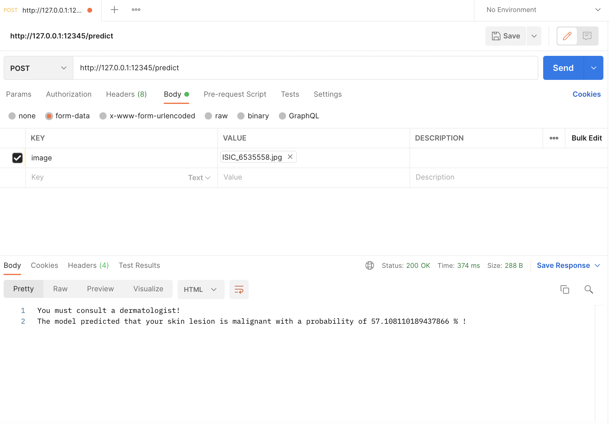

# Melanoma classification REST API 

---

This repository contains the code associated to a REST API which aims to classify skin lesions. The proposed package extends the work that has been done on [Melanoma Detection and Skin Cancer Classification](https://github.com/hippolytelrm/Melanoma-Detection--MastersThesis). 


## Outline 
[I - Overview](#i---overview)


[II - Installation](#ii---installation)


[III - References](#iii---references)


[IV - To go further](#iv---further)


---

## I - Overview

Using skin lesion data from the [ISIC archive database](https://www.isic-archive.com/), we implemented an API to display and test the outputs of a Deep Learning model (which was the result of a [previous project](https://github.com/hippolytelrm/Melanoma-Detection--MastersThesis), as mentioned above.  The code is designed to be modular, functional and easily replayable on any environment (see [Installation](#ii---installation)).

## II - Installation

Make sure you first clone the repository. Then you can directly jump to the [Starting kit](get_started/README.md) to get started.

We propose to install the repository using a conda **conda** environment. We will discuss this choice in the [To go further]((#iv---further)) section.

Follow the <code>README.md</code> in the ```get_started``` folder.


## III - The API

The proposed API enables to predict the malignancy of a skin lesion photo uploaded by the user. The package uses Flask and we used Postman as an interface to upload the skin lesion pictures. 
Flask is a web framework for Python, meaning that it provides functionality for building web applications, including managing HTTP requests and rendering templates.

We chose Flask framework as it comes with an inbuilt light-weighted web server which needs minimal configuration. 

With this package, we provide some unit tests. The code related to unit test can be found in the directory ```tests``` and contains a few tests regarding the model loading and image pre-processing. 
We also used [Git Large File Systeme](https://git-lfs.github.com/) to handle the model size of 136 MB which is way larger than the authorized uploading size.

An example of inference using the API is represented in the following Figure. The model returns the class (benign or malignant) as well as the confidence of the prediction. 



**Important note**:

We tried as much as possible to make the model replayable using any environment. 
The proposed API is delivered with a starting kit (see <code>README.md</code> in the ```get_started``` folder) that enable to make 
To develop this package, we used a Mac M1 with an arm64 architecture. 
The original version of ```Tensorflow``` is not supported, hence an official version has been developed to use Tensorflow on Mac M1 (see [tensorflow_macos](https://github.com/apple/tensorflow_macos)).
However, when we tried switching to a Linux environment, and changing ```tensorflow-macos==2.5.0``` to ```tensorflow==2.5.0```, we had some packages version conflicts, which made it not replayable. 

**UPDATE**:

In order to make the API work on another environments (Linux, MACOS), we created a ```requirement_linux_MACOS.txt``` file associated to a `quick_start_linux_MACOS.sh` script. 
Thus, the <code>README.md</code> in the ```get_started``` folder contains an installation kit either for MAC M1 environment users or for Linux environment users.

## IV - To go further

In order to improve this work, several changes can be done:
* Using a more powerful web service development framework (FastAPI, Django)
* installing the necessary dependencies using Docker
* ~~Solving the dependencies conflict caused using Tensorflow-macos~~