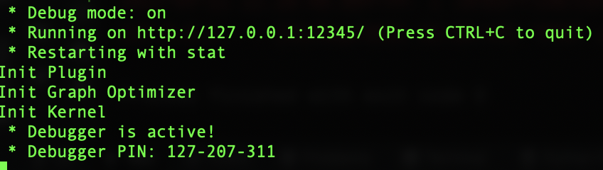
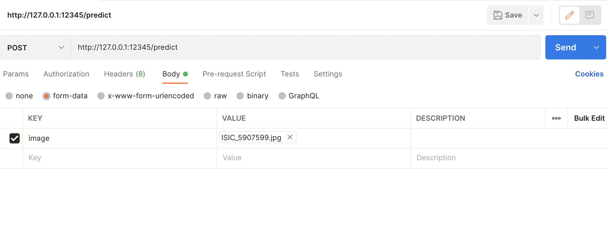
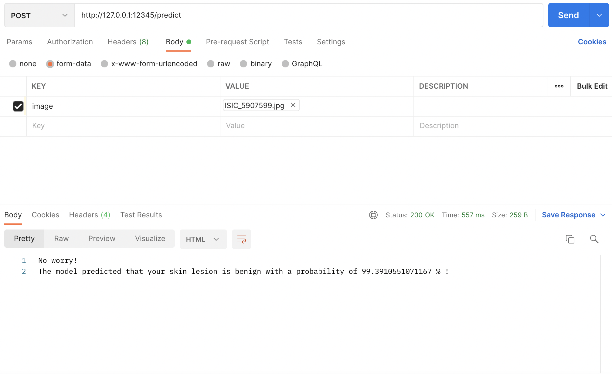

# Melanoma Detection REST API starting kit


---
In this document, we present how to setup the tools to get started with the api. This step is important because it makes the provided code easily replayable on any environment.

In this `README.md` file, you can find the instructions to setup the environment to make the Melanoma Detection API ready to use.

---

<u>**Outline**</u>
* [Setup](#setup)
* [Getting started with Melanoma Detection REST API](#get-started)
* [Contact us](#contact-us)

## Setup

### Download the starting kit
You should clone the whole **melanoma_detection_api** repository first by running the following command in the empty root directory of your project :
```
git clone https://github.com/hippolytelrm/melanoma_detection_api
```

In order to install the necessary dependencies, we use a [Conda environment](#set-up-the-environment-with-anaconda). We discuss this choice and some amelioration in the main <code>README.md</code>. 


### Set up the environment with Anaconda

**Note** : We assume that you have already installed anaconda on your device. If it's not the case, please check out the right installation guide for your machine in the following link : [conda installation guide](https://docs.conda.io/projects/conda/en/latest/user-guide/install/).

A script `quick_start.sh` is available and allows to quickly set up a conda environment with all the required modules/packages installed. 
Make sure you have cloned the melanoma_detection_api repository beforehand. 

Your root directory should look like the following : 
```
<root_directory>
|   melanoma_detection_api
```

Then, set your current working directory to be in the get_started folder using the following command :
```bash
cd melanoma_detection_api/get_started/
```

Then you can run the `quick_start.sh` script :
```bash
bash quick_start.sh
```
This script creates a Python 3.8.11 conda environment named **melanoma_detection_api**, install all packages/modules required.

**Note**: During the execution, the terminal will ask you to confirm the installation of packages, make sure you accept.

Once everything is installed, you can now activate your environment with this command: 
```bash
conda activate melanoma_detection_api
```

## Getting started with Melanoma Detection REST API

Note: the propsoed package requires the use of an API platform. We used [Postman](https://www.postman.com/downloads/).

The first step you need to follow is to activate the previously created conda environment, with the following command. 

```bash
conda activate melanoma_detection_api
```

Then, set your current working directory to be in the melanoma_detection_api folder using the following command :

```bash
cd melanoma_detection_api
```

Once your current working directory is in melanoma_detection_api, you can run the <code>prediction_api.py</code>:

```bash
python prediction_api.py
```

In our case, the previous command displays the following results on the terminal:



The output indicates that the API is running at the following address: ``http://127.0.0.1:12345/``.
Thus, you just need copy the address and open Postman. Once Postman is open, you create a ``new HTTP REQUEST``, select the method ``POST`` and paste the request URL: ``http://127.0.0.1:12345/predict`` because the execution of the function <code>prediction()</code> in <code>prediction_api.py</code> has been parametrized with ``\predict``. 



Finally, selecting form-data and setting ```KEY``` to ``image``, you can import both images of benign and malignant skin lesion form the ```data``` folder.
We provide an example using ```ISIC_5907599.jpg``` which as been diagnosed as a melanoma. The example is depicted in the following Figure:



The user can read the following output: 

```bash
The model predicted that your skin lesion is malignant with a probability of 61.8121862411499 % !

```

## Contact us 
If you have any questions, please contact us via : 
<hippolytemayard@gmail.com>
